# 📚 SPARC Framework Complete User Guide

## 🎯 Table of Contents

1. [Framework Overview](#framework-overview)
2. [Quick Start Guide](#quick-start-guide)
3. [Agent Workflow Guide](#agent-workflow-guide)
4. [YOLO Protocol Integration](#yolo-protocol-integration)
5. [TDD-Guard Implementation](#tdd-guard-implementation)
6. [Best Practices](#best-practices)
7. [Troubleshooting](#troubleshooting)
8. [Advanced Usage](#advanced-usage)

## 🏗️ Framework Overview

### What is SPARC?

**SPARC** (Structured Product Architecture Requirement Creation) is a comprehensive development framework that combines:

- **🤖 Structured Agent Workflows** - 9 specialized agents for complete project lifecycle
- **🧪 TDD-Guard Integration** - Strict test-driven development enforcement
- **🚀 YOLO Protocol Compliance** - Incremental delivery with quality gates
- **📋 Complete Documentation** - From PRD to implementation plan
- **🔒 Quality Enforcement** - Automated validation and compliance checking

### Framework Architecture

```mermaid
graph TB
    A[🔵 Product Manager] --> B[🟠 Solution Architect]
    B --> C[🟣 UX Designer]
    C --> D[🟡 Visual Style Specialist]
    D --> E[🟢 Data Architect]
    E --> F[🔴 Senior API Developer]
    F --> G[⚫ Project Planner]
    G --> H[🟤 Senior Coder]
    H --> I[🔴 TDD-Guard Tester]
    
    J[🚀 YOLO Protocols] -.-> H
    J -.-> I
    K[🛡️ TDD-Guard] -.-> H
    K -.-> I
```



### Key Benefits

- **🎯 Structured Approach** - Predictable, repeatable project delivery
- **🔒 Quality Assurance** - Built-in quality gates and validation
- **📈 Rapid Development** - Incremental delivery with YOLO protocols
- **🧪 Test-Driven** - Comprehensive testing integration
- **📝 Complete Documentation** - Professional-grade project documentation
- **🤝 Team Coordination** - Clear handoffs and responsibilities

## 🚀 Quick Start Guide

### Prerequisites

```bash
# Required tools
- Claude Code CLI
- Git
- Node.js 18+
- Python 3.11+
- GitHub CLI (gh)

# Verify installations
claude --version
git --version
node --version
python --version
gh --version
```

### Installation

#### Option 1: Automated Setup (Recommended)
```bash
# Clone SPARC framework
git clone https://github.com/rsham004/claude-sparc-agent-config.git
cd claude-sparc-agent-config

# Run automated setup
./setup-sparc-project.sh my-awesome-project

# Follow the setup prompts
```

#### Option 2: Manual Setup
```bash
# Create project structure
mkdir my-project && cd my-project
mkdir -p .claude/agents/my-project
mkdir -p docs/design/my-project
mkdir -p src tests

# Copy SPARC agents
cp /path/to/sparc/agents/colored/*.md .claude/agents/my-project/

# Initialize Git
git init
git add .
git commit -m "Initial SPARC framework setup"
```

### First Project

```bash
# Start with Product Manager agent
claude "Execute Product Manager agent to create PRD for my project idea: [describe your project]"

# Follow SPARC workflow sequence
claude "Show current SPARC framework status and next required steps"
```

## 🤖 Agent Workflow Guide

### Phase 1: Design & Architecture (Agents 1-7)

#### 🔵 Product Manager Agent
**Purpose:** Create comprehensive Product Requirements Document

**Input:** Project idea and business requirements  
**Output:** `PRD.md` with user stories, success metrics, constraints

**Usage Example:**
```bash
claude "I want to build a task management app for remote teams. Execute Product Manager agent."
```

**Key Deliverables:**
- Elevator pitch and value proposition
- Target user personas
- Functional requirements prioritized
- User stories with acceptance criteria
- Success metrics and constraints

#### 🟠 Solution Architect Agent
**Purpose:** Design technical architecture and technology stack

**Input:** PRD from Product Manager  
**Output:** `Architecture.md` with tech stack, deployment strategy

**Usage Example:**
```bash
claude "Execute Solution Architect agent using the completed PRD"
```

**Key Deliverables:**
- Selected architecture pattern
- Technology stack with exact versions
- API design philosophy
- Database design overview
- Technology lock file (immutable)

#### 🟣 UX Designer Agent
**Purpose:** Create user interface design specifications

**Input:** PRD and Architecture Guide  
**Output:** `UX_Design.md` with layout, components, interactions

**Usage Example:**
```bash
claude "Execute UX Designer agent to create UI specifications"
```

**Key Deliverables:**
- Layout structure and components
- Interaction patterns
- Mobile/tablet/desktop considerations
- Typography and accessibility
- Design rationale

#### 🟡 Visual Style Specialist Agent
**Purpose:** Generate visual style concepts and branding

**Input:** UX Design Document  
**Output:** `Visual_Style_Concepts.md` with 9 distinct styles

**Usage Example:**
```bash
claude "Execute Visual Style Specialist agent to generate visual concepts"
```

**Key Deliverables:**
- 9 distinct visual style concepts
- Style recommendations for target audience
- Implementation guidance
- Visual design specifications

#### 🟢 Data Architect Agent
**Purpose:** Design database schema and data models

**Input:** Architecture Guide and requirements  
**Output:** `Database_Design.md` with SQLModel schemas

**Usage Example:**
```bash
claude "Execute Data Architect agent to design database schema"
```

**Key Deliverables:**
- Entity relationship design
- SQLModel class definitions
- Migration strategy
- Performance considerations

#### 🔴 Senior API Developer Agent
**Purpose:** Design comprehensive API specifications

**Input:** All previous design documents  
**Output:** `API_Specification.md` with FastAPI endpoints

**Usage Example:**
```bash
claude "Execute Senior API Developer agent to design API specifications"
```

**Key Deliverables:**
- Complete API endpoint specifications
- Authentication and authorization
- Error handling strategy
- Performance optimization
- Testing strategy

#### ⚫ Project Planner Agent
**Purpose:** Create detailed implementation plan

**Input:** All design documents  
**Output:** `Implementation_Plan.md` with phased approach

**Usage Example:**
```bash
claude "Execute Project Planner agent to create implementation plan"
```

**Key Deliverables:**
- 7-phase implementation breakdown
- Timeline estimates and dependencies
- Risk assessment and mitigation
- Success criteria and quality gates

### Phase 2: Implementation & Quality (Agents 8-9)

#### 🟤 Senior Coder Agent
**Purpose:** Implement production-ready code with TDD

**Input:** All design documents and implementation plan  
**Output:** Complete codebase with test suite

**Usage Example:**
```bash
claude "Execute Senior Coder agent to begin implementation following TDD principles"
```

**Key Features:**
- Test-driven development enforcement
- YOLO protocol compliance
- Code quality standards
- Security best practices

#### 🔴 TDD-Guard Tester Agent
**Purpose:** Enforce testing standards and quality gates

**Input:** Implementation code from Senior Coder  
**Output:** Comprehensive test validation report

**Usage Example:**
```bash
claude "Execute TDD-Guard Tester agent to validate implementation quality"
```

**Key Features:**
- TDD cycle validation
- Quality gate enforcement
- Security testing
- Performance validation
- Accessibility compliance

### Workflow Validation

#### Check Current Status
```bash
# Show workflow progress
claude "What is the current SPARC framework status?"

# Validate phase completion
claude "Validate that Phase 1 design documents are complete"

# Show blocking issues
claude "List any blocking issues preventing next phase"
```

#### Agent Dependencies
```bash
# Each agent requires outputs from previous agents
# Framework automatically validates dependencies
# Manual validation available:
claude "Validate agent dependencies for current phase"
```

## 🚀 YOLO Protocol Integration

### Understanding YOLO in SPARC

YOLO (You Only Live Once) protocols provide systematic incremental delivery:

- **📊 Hierarchical Structure:** EPIC → Features → Issues
- **🔢 Delivery Limits:** Max 7 features per EPIC, max 3 issues per feature
- **🚀 Deployment Strategy:** Blue-green with canary releases
- **📈 Quality Metrics:** <1% error rate, >99% uptime

### YOLO Workflow

#### EPIC Planning
```bash
# Start YOLO EPIC from SPARC design
claude --yolo-epic-create "User Management System" --features=7

# Decompose SPARC deliverables into YOLO features
claude --yolo-decompose-sparc-plan "Implementation_Plan.md"
```

#### Feature Development
```bash
# Create feature from SPARC requirements
claude --yolo-feature-create "User Authentication" --issues=3

# Track feature progress
claude --yolo-feature-status "User Authentication"
```

#### Issue Implementation
```bash
# Create implementation issue
claude --yolo-issue-create "Implement login endpoint" --tdd-required

# Validate TDD compliance
claude --tdd-guard-validate-issue "login-endpoint"
```

### Deployment Pipeline

#### Canary Deployment
```yaml
# Automated YOLO deployment stages
deployment_stages:
  - blue_green_staging     # 0% production traffic
  - canary_5_percent      # 5% production traffic
  - canary_25_percent     # 25% production traffic
  - canary_50_percent     # 50% production traffic
  - full_production       # 100% production traffic

# Automatic rollback triggers
rollback_conditions:
  - error_rate > 1%
  - response_time > 500ms
  - availability < 99.9%
```

#### Monitoring Commands
```bash
# Monitor deployment health
claude --yolo-monitor-deployment --stage=canary-5

# Check quality metrics
claude --yolo-quality-report --epic="User Management"

# Trigger rollback if needed
claude --yolo-rollback --stage=canary-25 --reason="error_rate_exceeded"
```

## 🛡️ TDD-Guard Implementation

### TDD-Guard Philosophy

TDD-Guard enforces strict test-driven development:

1. **🔴 RED Phase:** Write failing test
2. **🟢 GREEN Phase:** Write minimal code to pass
3. **🔵 REFACTOR Phase:** Improve code quality

### TDD-Guard Configuration

```python
# TDD-Guard Settings
TDD_GUARD_CONFIG = {
    "enforce_test_first": True,
    "minimum_coverage": 90,
    "block_commits_without_tests": True,
    "validate_red_green_refactor": True,
    "automated_quality_gates": True
}
```

### TDD Workflow Commands

#### Test-First Development
```bash
# Start TDD cycle for new feature
claude --tdd-start "user authentication feature"

# Write failing test (RED phase)
claude --tdd-red "test user login with valid credentials should succeed"

# Implement minimal code (GREEN phase)
claude --tdd-green "implement basic login functionality"

# Refactor for quality (REFACTOR phase)
claude --tdd-refactor "optimize login performance and error handling"
```

#### Quality Gate Validation
```bash
# Run all quality gates
claude --tdd-guard-validate-all

# Check specific quality metrics
claude --tdd-guard-coverage-check --minimum=90
claude --tdd-guard-security-scan
claude --tdd-guard-performance-test
```

### TDD-Guard Integration with SPARC Agents

#### Senior Coder Integration
```bash
# Coder agent with TDD-Guard enforcement
claude "Execute Senior Coder agent with strict TDD-Guard enforcement for user authentication feature"
```

#### Tester Agent Validation
```bash
# Comprehensive testing validation
claude "Execute TDD-Guard Tester agent to validate implementation quality and test coverage"
```

## 💡 Best Practices

### Project Setup Best Practices

1. **📁 Directory Structure**
   ```
   my-project/
   ├── .claude/agents/my-project/    # SPARC agents
   ├── docs/design/my-project/       # Design documents
   ├── src/                          # Source code
   ├── tests/                        # Test suite
   ├── .github/workflows/            # CI/CD pipelines
   └── CLAUDE.md                     # Project memory
   ```

2. **🔧 Environment Setup**
   ```bash
   # Set up development environment
   python -m venv venv
   source venv/bin/activate
   pip install -r requirements.txt
   
   # Configure pre-commit hooks
   pre-commit install
   ```

3. **📋 Git Configuration**
   ```bash
   # Configure Git for SPARC workflow
   git config core.hooksPath .githooks
   git config branch.autosetupmerge always
   git config branch.autosetuprebase always
   ```

### Development Workflow Best Practices

1. **📐 Agent Execution Order**
   - Always follow SPARC sequence: PM → SA → UX → VS → DA → API → PP → Coder → Tester
   - Validate dependencies before proceeding to next agent
   - Review and approve each agent output before continuing

2. **🧪 TDD Integration**
   - Enable TDD-Guard before starting implementation
   - Write tests for every user story and acceptance criteria
   - Maintain minimum 90% test coverage
   - Validate red-green-refactor cycle compliance

3. **🚀 YOLO Delivery**
   - Plan EPICs based on SPARC design phase outputs
   - Decompose features to fit 2-5 day delivery windows
   - Limit issues to single responsibility principle
   - Monitor deployment metrics continuously

### Quality Assurance Best Practices

1. **🔒 Security**
   ```bash
   # Security scanning integration
   bandit -r src/
   safety check
   npm audit
   ```

2. **📈 Performance**
   ```bash
   # Performance monitoring
   lighthouse --chrome-flags="--headless"
   pytest --benchmark-only
   ```

3. **♿ Accessibility**
   ```bash
   # Accessibility validation
   axe-core --include="*"
   pa11y http://localhost:3000
   ```

### Team Collaboration Best Practices

1. **📋 Documentation Standards**
   - Keep design documents updated throughout development
   - Document all architectural decisions and rationale
   - Maintain clear API documentation with examples

2. **🤝 Code Review Process**
   ```bash
   # Code review checklist
   - [ ] TDD-Guard compliance verified
   - [ ] SPARC design specifications followed
   - [ ] YOLO delivery constraints respected
   - [ ] Security best practices implemented
   - [ ] Performance targets met
   ```

3. **📊 Progress Tracking**
   ```bash
   # Regular status updates
   claude "Generate SPARC framework progress report"
   claude "Show YOLO delivery metrics dashboard"
   claude "Display TDD-Guard compliance summary"
   ```

## 🔧 Troubleshooting

### Common Issues and Solutions

#### Agent Execution Issues

**Problem:** Agent fails to execute or produces incomplete output
```bash
# Solution: Validate dependencies and inputs
claude "Validate current agent dependencies and missing inputs"
claude "Show required documents for [agent-name] execution"
```

**Problem:** Technology lock violations
```bash
# Solution: Check technology compliance
claude "Validate technology lock compliance for current implementation"
claude "Show approved technologies from Solution Architect"
```

#### TDD-Guard Issues

**Problem:** TDD-Guard blocking commits
```bash
# Solution: Fix TDD compliance
claude --tdd-guard-diagnose --show-violations
claude --tdd-guard-fix --issue="missing_tests"
```

**Problem:** Test coverage below threshold
```bash
# Solution: Improve test coverage
claude --tdd-coverage-report --detailed
claude --tdd-add-tests --target-coverage=90
```

#### YOLO Protocol Issues

**Problem:** Feature too large for delivery window
```bash
# Solution: Further decomposition
claude --yolo-decompose-feature "Large Feature Name" --max-issues=3
claude --yolo-estimate-complexity --feature-id=123
```

**Problem:** Deployment pipeline failures
```bash
# Solution: Validate deployment readiness
claude --yolo-deployment-check --stage=canary-5
claude --yolo-rollback --reason="deployment_failed"
```

### Debug Commands

```bash
# Framework diagnostics
claude --sparc-diagnostic --full-check
claude --yolo-diagnostic --deployment-health
claude --tdd-guard-diagnostic --coverage-analysis

# Validation commands
claude --validate-all-documents
claude --validate-technology-compliance
claude --validate-quality-gates

# Recovery commands
claude --sparc-recovery --from-backup
claude --yolo-emergency-rollback
claude --tdd-guard-reset --preserve-tests
```

### Getting Help

1. **📚 Documentation**
   - Review agent-specific documentation in `.claude/agents/`
   - Check framework principles in `ProductFoundryAI_principles.md`
   - Consult implementation examples in `docs/examples/`

2. **🔍 Community Support**
   - Join ProductFoundry.ai community discussions
   - Submit issues to GitHub repository
   - Participate in weekly AI Builders Circle sessions

3. **🛟 Professional Support**
   - ProductFoundry.ai consulting services
   - Custom framework implementations
   - Team training and workshops

## 🚀 Advanced Usage

### Custom Agent Development

#### Creating Custom Agents
```markdown
# Custom Agent Template
# 🟦 **Custom Agent Name**
*Color Code: BLUE - Custom Function*

**Role:** Expert in [specific domain]
**Context:** [Agent purpose and integration point]
**Goal:** [Specific deliverable and quality standards]

**Inputs:**
- [Required documents from previous agents]
- [Additional requirements]

**Instructions:**
1. [Step-by-step process]
2. [Quality validation requirements]
3. [Integration specifications]

**Deliverable:** [Output format and file name]
```

#### Agent Integration
```bash
# Register custom agent
claude --register-agent custom-agent.md --position=after:project-planner

# Execute custom agent
claude "Execute custom agent for specialized requirements"
```

### Framework Customization

#### Custom Quality Gates
```python
# Custom quality gate definition
class CustomQualityGate:
    def __init__(self, name, threshold, validation_func):
        self.name = name
        self.threshold = threshold
        self.validation_func = validation_func
    
    def validate(self, metrics):
        result = self.validation_func(metrics)
        if result < self.threshold:
            raise QualityGateFailure(
                f"{self.name} failed: {result} < {self.threshold}"
            )
        return True

# Register custom gate
claude --register-quality-gate custom-gate.py
```

#### Custom YOLO Workflows
```yaml
# Custom YOLO configuration
custom_yolo_config:
  epic_size_limit: 10        # Custom EPIC size
  feature_duration: "1-week" # Custom feature timeline
  deployment_stages:         # Custom deployment pipeline
    - development
    - staging
    - user-acceptance
    - production
  
  quality_thresholds:
    error_rate: 0.5%         # Stricter error rate
    response_time: 200ms     # Faster response requirement
```

### Enterprise Integration

#### CI/CD Pipeline Integration
```yaml
# Enterprise CI/CD integration
enterprise_pipeline:
  sparc_validation:
    - document_completeness_check
    - design_consistency_validation
    - stakeholder_approval_gates
  
  yolo_compliance:
    - feature_size_validation
    - delivery_timeline_check
    - deployment_readiness_assessment
  
  tdd_guard_enforcement:
    - comprehensive_test_suite_validation
    - security_compliance_check
    - performance_benchmark_validation
```

#### Team Scaling
```bash
# Multi-team coordination
claude --sparc-team-setup --teams="frontend,backend,mobile"
claude --yolo-epic-assignment --team=frontend --epic="User Interface"
claude --tdd-guard-team-metrics --show-team-performance
```

#### Metrics and Analytics
```python
# Enterprise metrics dashboard
class EnterpriseMetrics:
    def __init__(self):
        self.team_performance = {}
        self.project_health = {}
        self.quality_trends = {}
    
    def generate_executive_report(self):
        return {
            "sparc_adoption_rate": self.calculate_sparc_adoption(),
            "yolo_delivery_velocity": self.calculate_delivery_velocity(),
            "tdd_guard_compliance": self.calculate_tdd_compliance(),
            "overall_project_health": self.assess_project_health()
        }
```

---

## 📞 Support and Resources

### Quick Reference
- **🏠 Framework Home:** [ProductFoundry.ai](https://www.productfoundry.ai)
- **📚 Documentation:** `/docs-site/` directory
- **🤝 Community:** Weekly AI Builders Circle sessions
- **🐛 Issues:** GitHub repository issue tracker
- **💡 Examples:** `/docs/examples/` directory

### Contact Information
- **Community Discord:** [ProductFoundry.ai Discord](https://discord.gg/productfoundry)
- **GitHub Repository:** [SPARC Framework Repo](https://github.com/rsham004/claude-sparc-agent-config)
- **Professional Support:** [consulting@productfoundry.ai](mailto:consulting@productfoundry.ai)

---

**📋 User Guide Status:** ✅ **Complete and Production Ready**  
**Created:** July 27, 2025  
**Framework Version:** SPARC v2.0 with YOLO and TDD-Guard Integration  
**Last Updated:** July 27, 2025

**🌟 Built with love by the ProductFoundry.ai community** - *Licensed under [Creative Commons BY-NC 4.0](https://creativecommons.org/licenses/by-nc/4.0/)*