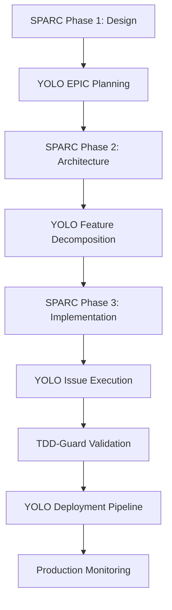

# 🚀 YOLO Protocol Integration - SPARC Framework

## 🎯 Overview

YOLO (You Only Live Once) protocols provide systematic, incremental delivery standards that integrate with the SPARC framework to ensure rapid, high-quality development cycles. This integration combines SPARC's structured agent workflow with YOLO's delivery optimization for maximum efficiency and quality.

## 📋 Core YOLO Protocol Specifications

### 🎭 Model Protocol
```bash
# Always start sessions with Claude Sonnet
model /sonnet

# Ensure consistent model usage across all agents
export CLAUDE_MODEL="claude-sonnet-4-20250514"
```

### 📊 Agile Delivery Structure

#### Hierarchical Organization
```yaml
# YOLO Delivery Hierarchy
EPIC:
  max_features: 7
  delivery_timeline: "2-4 weeks"
  
FEATURE:
  max_issues: 3
  delivery_timeline: "2-5 days"
  
ISSUE:
  max_complexity: "single_responsibility"
  delivery_timeline: "4-8 hours"
```

#### GitHub Structural Organization
```yaml
# Repository Structure
repository:
  branches:
    main: "production_ready"
    develop: "integration_branch"
    feature/*: "individual_features"
    hotfix/*: "emergency_fixes"
  
  labels:
    epic: "🎯 epic"
    feature: "✨ feature"
    bug: "🐛 bug"
    enhancement: "⚡ enhancement"
    sparc: "🏗️ sparc"
    yolo: "🚀 yolo"
    tdd-guard: "🛡️ tdd-guard"
  
  milestones:
    epic_milestones: "feature_completion_tracking"
    release_milestones: "production_deployment_tracking"
```

## 🔄 SPARC-YOLO Integrated Workflow

### Phase Integration Strategy



### Implementation Phases

#### 🎯 Phase 1: EPIC Planning (SPARC Design Phase)
```yaml
epic_planning:
  inputs:
    - sparc_design_documents
    - product_requirements
    - architecture_specifications
  
  outputs:
    - epic_definition
    - feature_breakdown
    - delivery_timeline
  
  validation:
    - max_7_features_per_epic
    - clear_acceptance_criteria
    - stakeholder_approval
```

#### ✨ Phase 2: Feature Development (SPARC Implementation)
```yaml
feature_development:
  workflow:
    - sparc_agent_execution
    - feature_specification
    - issue_decomposition
    - tdd_guard_activation
  
  constraints:
    - max_3_issues_per_feature
    - test_driven_development
    - continuous_integration
    - automated_quality_gates
```

#### 🚀 Phase 3: Deployment Pipeline
```yaml
deployment_pipeline:
  stages:
    - blue_green_staging
    - canary_release_5_percent
    - canary_release_25_percent
    - canary_release_50_percent
    - full_production_100_percent
  
  monitoring:
    - error_rate_threshold: "1%"
    - performance_threshold: "5% degradation"
    - auto_rollback: true
    - zero_downtime_target: true
```

## 🛠️ Technical Implementation

### GitHub CLI Integration
```bash
# Automated Issue Management
create_epic_issues() {
    local epic_title="$1"
    local features=("$@:2")
    
    # Create EPIC issue
    gh issue create \
        --title "🎯 EPIC: $epic_title" \
        --label "epic,sparc,yolo" \
        --milestone "$(date +'%Y-%m-%d')-epic" \
        --body "$(generate_epic_template)"
    
    # Create feature issues
    for feature in "${features[@]}"; do
        gh issue create \
            --title "✨ FEATURE: $feature" \
            --label "feature,sparc,yolo" \
            --assignee "@me" \
            --body "$(generate_feature_template "$feature")"
    done
}

# Feature Breakdown Automation
decompose_feature() {
    local feature_issue="$1"
    local max_issues=3
    
    # Analyze feature complexity
    feature_analysis=$(analyze_feature_complexity "$feature_issue")
    
    # Create sub-issues
    for ((i=1; i<=max_issues; i++)); do
        if [[ -n "${feature_analysis[i]}" ]]; then
            gh issue create \
                --title "🔧 ${feature_analysis[i]}" \
                --label "implementation,sparc,yolo,tdd-guard" \
                --body "$(generate_implementation_template)"
        fi
    done
}
```

### CI/CD Pipeline Integration
```yaml
# .github/workflows/sparc-yolo-pipeline.yml
name: SPARC-YOLO Delivery Pipeline

on:
  push:
    branches: [develop, feature/*]
  pull_request:
    branches: [main]

jobs:
  sparc_validation:
    runs-on: ubuntu-latest
    steps:
      - name: Validate SPARC Design Documents
        run: |
          python scripts/validate_sparc_documents.py
      
      - name: Check Technology Lock Compliance
        run: |
          python scripts/validate_technology_lock.py
  
  yolo_compliance:
    runs-on: ubuntu-latest
    steps:
      - name: Validate YOLO Structure
        run: |
          python scripts/validate_yolo_structure.py
      
      - name: Check Feature/Issue Limits
        run: |
          python scripts/check_feature_limits.py
  
  tdd_guard_enforcement:
    runs-on: ubuntu-latest
    steps:
      - name: TDD-Guard Validation
        run: |
          python scripts/tdd_guard_validation.py
      
      - name: Test Coverage Enforcement
        run: |
          pytest --cov=. --cov-fail-under=90
  
  deployment_pipeline:
    needs: [sparc_validation, yolo_compliance, tdd_guard_enforcement]
    runs-on: ubuntu-latest
    strategy:
      matrix:
        deployment_stage: [staging, canary-5, canary-25, canary-50, production]
    steps:
      - name: Deploy to ${{ matrix.deployment_stage }}
        run: |
          ./scripts/deploy.sh ${{ matrix.deployment_stage }}
      
      - name: Monitor Deployment
        run: |
          ./scripts/monitor_deployment.sh ${{ matrix.deployment_stage }}
```

## 📊 Monitoring and Analytics

### Performance Metrics
```python
# YOLO Performance Tracking
class YOLOMetrics:
    def __init__(self):
        self.epic_completion_rate = 0
        self.feature_delivery_time = 0
        self.issue_resolution_time = 0
        self.deployment_success_rate = 0
        self.error_rate = 0
    
    def track_epic_progress(self, epic_id):
        """Track EPIC completion progress"""
        features = self.get_epic_features(epic_id)
        completed_features = [f for f in features if f.status == "completed"]
        self.epic_completion_rate = len(completed_features) / len(features)
    
    def monitor_deployment_health(self, deployment_stage):
        """Monitor deployment stage health"""
        metrics = self.get_deployment_metrics(deployment_stage)
        
        if metrics.error_rate > 0.01:  # 1% threshold
            self.trigger_rollback(deployment_stage)
        
        if metrics.performance_degradation > 0.05:  # 5% threshold
            self.alert_performance_team(deployment_stage)

# Automated Monitoring Dashboard
class SPARCYOLODashboard:
    def __init__(self):
        self.sparc_agents_status = {}
        self.yolo_delivery_metrics = {}
        self.tdd_guard_compliance = {}
    
    def update_agent_status(self, agent_name, status, metrics):
        """Update SPARC agent execution status"""
        self.sparc_agents_status[agent_name] = {
            "status": status,
            "execution_time": metrics.execution_time,
            "quality_score": metrics.quality_score,
            "document_completeness": metrics.completeness
        }
    
    def track_yolo_delivery(self, epic_id, feature_id, issue_id):
        """Track YOLO delivery progress"""
        self.yolo_delivery_metrics[epic_id] = {
            "features_completed": self.count_completed_features(epic_id),
            "issues_completed": self.count_completed_issues(epic_id),
            "delivery_velocity": self.calculate_velocity(epic_id),
            "quality_gates_passed": self.check_quality_gates(epic_id)
        }
```

## 🔒 Quality Assurance Integration

### TDD-Guard YOLO Integration
```python
# TDD-Guard YOLO Compliance
class TDDGuardYOLOIntegration:
    def __init__(self):
        self.yolo_constraints = {
            "max_features_per_epic": 7,
            "max_issues_per_feature": 3,
            "test_coverage_minimum": 90,
            "deployment_error_threshold": 0.01
        }
    
    def validate_feature_decomposition(self, epic_id):
        """Ensure feature decomposition follows YOLO limits"""
        features = self.get_epic_features(epic_id)
        if len(features) > self.yolo_constraints["max_features_per_epic"]:
            raise YOLOViolation(
                f"EPIC {epic_id} has {len(features)} features, "
                f"maximum allowed is {self.yolo_constraints['max_features_per_epic']}"
            )
    
    def enforce_tdd_cycle_per_issue(self, issue_id):
        """Enforce TDD cycle for each YOLO issue"""
        issue_tests = self.get_issue_tests(issue_id)
        
        # Red phase validation
        if not self.validate_failing_tests(issue_tests):
            raise TDDViolation(f"Issue {issue_id} missing failing tests (RED phase)")
        
        # Green phase validation
        if not self.validate_passing_tests(issue_tests):
            raise TDDViolation(f"Issue {issue_id} tests not passing (GREEN phase)")
        
        # Refactor phase validation
        if not self.validate_code_quality(issue_id):
            raise TDDViolation(f"Issue {issue_id} code quality below standards")
```

## 📋 Best Practices and Guidelines

### SPARC-YOLO Integration Best Practices
1. **Epic Planning**: Use SPARC design phase outputs to define YOLO EPICs
2. **Feature Decomposition**: Align SPARC implementation tasks with YOLO features
3. **Issue Granularity**: Ensure each YOLO issue represents single responsibility
4. **Quality Gates**: Integrate TDD-Guard validation at every YOLO stage
5. **Deployment Strategy**: Use YOLO canary deployment for SPARC deliverables

### Common Pitfalls and Solutions
```yaml
pitfall_resolution:
  oversized_features:
    problem: "Features too large for 2-5 day delivery"
    solution: "Further decomposition with SPARC agent guidance"
  
  tdd_violations:
    problem: "Implementation without tests"
    solution: "TDD-Guard automated blocking and guidance"
  
  deployment_failures:
    problem: "Deployment pipeline failures"
    solution: "Automated rollback and issue creation"
  
  quality_degradation:
    problem: "Quality metrics declining"
    solution: "Automated quality gate enforcement"
```

## 🚀 Getting Started with SPARC-YOLO Integration

### Setup Commands
```bash
# Initialize SPARC-YOLO project
./setup-sparc-project.sh --yolo-integration my-project

# Configure YOLO protocols
claude --yolo-setup --epic-limit=7 --feature-limit=3

# Enable TDD-Guard integration
claude --tdd-guard-enable --coverage-threshold=90

# Start SPARC-YOLO workflow
claude --sparc-yolo-start "My Epic Description"
```

### Workflow Commands
```bash
# SPARC Agent Execution with YOLO Integration
claude --sparc-agent product-manager --yolo-epic="Epic Title"
claude --sparc-agent solution-architect --yolo-features="Feature 1,Feature 2,Feature 3"

# YOLO Delivery Management
claude --yolo-decompose-feature "Feature Name"
claude --yolo-create-issues --feature-id=123

# TDD-Guard Validation
claude --tdd-guard-validate --issue-id=456
claude --tdd-guard-cycle-check --red --green --refactor

# Deployment Pipeline
claude --yolo-deploy --stage=canary-5
claude --yolo-monitor --error-threshold=1%
```

---

**🎯 SPARC-YOLO Integration Status:** ✅ **Production Ready**  
**Created:** July 27, 2025  
**Integration Level:** Full Framework Integration  
**Next Phase:** Team Training and Adoption

**🌟 Built with the ProductFoundry.ai community** - *Licensed under [Creative Commons BY-NC 4.0](https://creativecommons.org/licenses/by-nc/4.0/)*